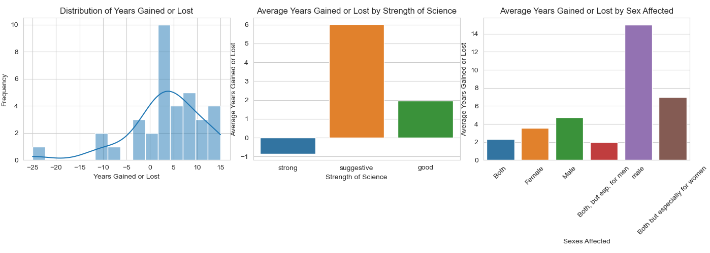

# Personalized Life Consultant

Utilize natural language processing and machine learning to obtain personalized life consulatation reports. Leverage the txtai library for semantic search and the GPT-4 engine for dynamic suggestions.

## Running main.py and EDA.py

To run the Python file and generate a personalized life consultation report or EDA, follow the steps outlined below:

## Installation and Setup

Ensure Python 3.x is installed. Download it from the [Python official website](https://www.python.org/).

### Step 1: Clone the Repository

```sh
gh repo clone William-Ger/Semantic_Therapist
```

### Step 2: Install the Dependencies

Navigate to the project directory and run:

```sh
pip install pandas txtai openai seaborn matplotlib
```

### Step 3: Configure OpenAI API Key

Open the script file and set your API key:

```python
openai.api_key = 'YOUR-OPENAI-API-KEY-HERE'
```

### Step 4: Run the Script

Execute the Python script via terminal or command prompt:

```sh
python path/to/your_script.py
```

### Step 5: Input Details

Follow the terminal prompts to provide your lifestyle details and improvement areas.

### Step 6: Access Your Report

The script will create a personalized report as a markdown file. Find it in the output directory.

> **Tip:** Convert the markdown file to PDF using the 'Markdown PDF' extension by yzane in VSCode.

## Features

- **Semantic Search:** Utilizes txtai for in-depth analysis.
- **GPT-4 Integration:** Leverages GPT-4 for dynamic suggestion creation.
- **Report Generation:** Creates comprehensive PDF reports.

## Exploratory Data Analysis (EDA)

The EDA facilitated a robust understanding of the dataset, identifying pivotal factors affecting life expectancy. Key steps included data cleaning, visualization, and feature engineering, providing a rich foundation for semantic analysis and report generation.



### Key Insights

1. **Bimodal Distribution:** Factors exhibit a bimodal distribution of effects on life expectancy.
2. **Scientific Backing:** Strong scientific backing often indicates negative life expectancy impacts.
3. **Sex-Based Differences:** Different factors disproportionately affect various sex categories, highlighting the dataset's depth.

For detailed insights and analysis, refer to the `eda` folder in the repository.

### Conclusion

The EDA process was pivotal in shaping the development of the application by providing a clear understanding of the dataset's structure and the relationships between different factors. It served as the foundation upon which the semantic analysis and report generation functionalities were built.

We encourage contributors and users to delve into the EDA process to garner a deeper understanding of the data and the initial analysis carried out in this project.
